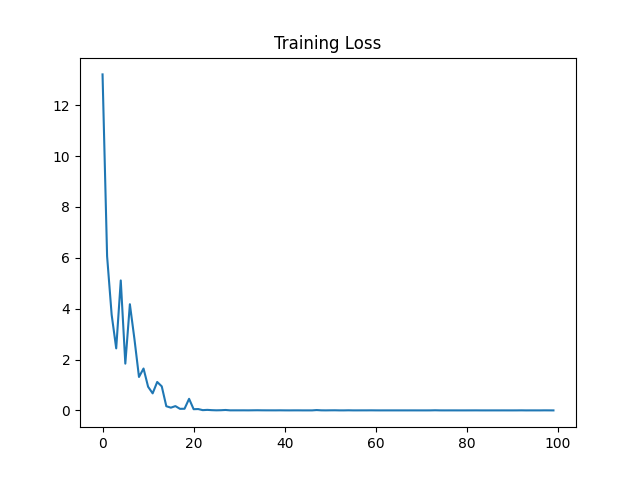
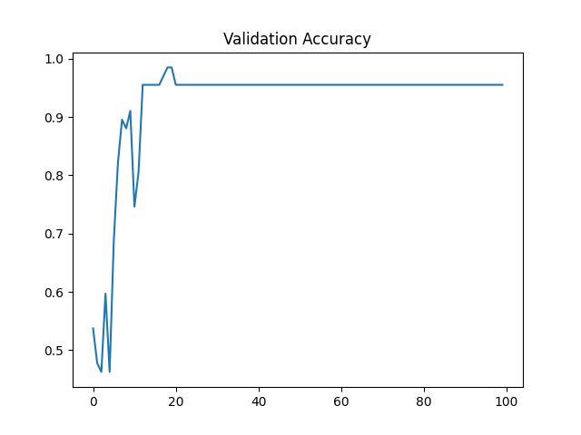

# Lung Cancer Detection System

## Educational Deep Learning Prototype for CT Image Classification

**Author:** Favour Okwudili  
**Program:** Computer Engineering  
**Project Type:** School project / educational prototype  
**Repository:** Lung_Cancer_Detection_System  

---

## Abstract

Lung cancer remains one of the most serious health conditions worldwide, and medical imaging plays an important role in its detection and clinical investigation. This project presents an educational Lung Cancer Detection System that demonstrates how deep learning can be applied to classify lung CT scan images into two categories: `cancer` and `no_cancer`. The system uses a ResNet-18 convolutional neural network implemented with PyTorch and Torchvision. The trained model is integrated into a Streamlit web application that allows a user to upload a CT scan image, view the predicted class, inspect the model confidence score, and examine visual explanation outputs.

In addition to classification, the system includes OpenCV-based lung region segmentation, Grad-CAM heatmap visualization, a hospital-style educational PDF report, and a system-focused chatbot that answers questions about the model, prediction, heatmap, dataset, report, and project limitations. The dataset is organized into training, validation, and testing folders. The current project dataset contains 470 usable images, with a balanced training set and separate validation and test sets. The reported test accuracy is 97.01%, with an F1-score of 0.97 and cancer recall of 1.00 on the project test set.

This project is not intended to be used as a real medical diagnosis tool. Instead, it is designed to demonstrate an end-to-end artificial intelligence workflow for medical image classification, including preprocessing, model training, evaluation, explainability, user interface development, and report generation.

## Keywords

Lung cancer detection, CT scan, deep learning, ResNet-18, PyTorch, Streamlit, Grad-CAM, OpenCV, image classification, medical image analysis, educational AI system.

---

## 1. Introduction

Lung cancer is a major disease that requires timely medical investigation and expert clinical interpretation. In real clinical environments, doctors and radiologists use imaging technologies such as computed tomography (CT) scans to examine lung structures and identify possible abnormalities. Because CT images contain detailed visual information, they are also suitable for computer vision experiments and machine learning research.

Artificial intelligence, especially deep learning, has become increasingly important in image analysis because convolutional neural networks can learn visual patterns directly from image data. In medical imaging, deep learning can be used to support classification, detection, segmentation, and visual explanation tasks. However, real medical AI systems require large clinical datasets, expert annotations, external validation, regulatory review, and careful ethical consideration.

This project focuses on the educational side of that workflow. The goal is not to replace medical experts or create a certified diagnostic product. Instead, the goal is to build a working prototype that demonstrates how a lung CT image classification system could be structured. The system accepts an uploaded image, checks whether it resembles a CT scan, classifies it using a trained ResNet-18 model, shows a confidence score, creates a Grad-CAM heatmap, performs simple segmentation, generates a PDF report, and provides a chatbot for project-related explanations.

The project therefore combines multiple important areas of computer engineering:

- Image preprocessing
- Deep learning model training
- Model evaluation
- Explainable AI
- Web application development
- PDF report generation
- Basic natural language interaction

The final application is presented through a Streamlit interface, making it easy to use during a school demonstration or project defense.

---

## 2. Related Work / Background

### 2.1 Medical Image Classification

Medical image classification is a computer vision task where an image is assigned to one or more diagnostic or descriptive categories. In this project, the classification problem is binary: each CT image is classified as either `cancer` or `no_cancer`. Binary classification is commonly used in introductory medical AI projects because it allows students to focus on the full workflow without needing a very complex label structure.

In real clinical systems, classification is more complicated. A model may need to handle different scan protocols, patient positions, image qualities, disease subtypes, and clinical metadata. For this reason, the current project clearly states that it is educational and not a real medical diagnosis system.

### 2.2 Convolutional Neural Networks

Convolutional neural networks (CNNs) are deep learning models designed for visual data. They use convolutional filters to learn spatial features from images. Early layers often learn simple patterns such as edges and textures, while deeper layers learn more complex structures. CNNs are widely used in classification, detection, and segmentation tasks.

The model used in this project is ResNet-18, a residual neural network architecture introduced by He et al. [1]. ResNet models use skip connections, also called residual connections, to help train deeper networks more effectively. These connections allow information to pass across layers and reduce the difficulty of optimizing deep neural networks.

### 2.3 Transfer Learning

Transfer learning is a technique where a model trained on a large dataset is reused for a new task. In this project, the training script initializes ResNet-18 with pretrained weights and replaces the final fully connected layer with a two-class output layer. This approach is useful for small datasets because the model can reuse general visual features learned from larger image datasets.

The final classification layer is modified as follows:

```python
model.fc = nn.Linear(model.fc.in_features, 2)
```

This makes the model output scores for the two project classes: `cancer` and `no_cancer`.

### 2.4 Explainable AI and Grad-CAM

Deep learning models are often described as black boxes because their decision-making process can be difficult to interpret. Explainable AI methods help users understand which parts of an input influenced a prediction. This is especially important in medical image projects because users need visual support for model outputs.

This project uses Grad-CAM, introduced by Selvaraju et al. [2]. Grad-CAM creates a heatmap that highlights regions of the image that contributed strongly to the model prediction. In the Streamlit app, the heatmap is displayed as the "AI Attention Heatmap." Warmer regions indicate areas that had greater influence on the classifier.

### 2.5 Image Segmentation

Segmentation is the process of separating important regions of an image from the background. In medical imaging, segmentation can be used to isolate organs, lesions, or regions of interest. This project uses a simple OpenCV-based segmentation method. The image is converted to grayscale, blurred, thresholded, inverted, cleaned with morphological operations, and then masked to show the lung region.

This segmentation method is not a deep learning segmentation model. It is used to demonstrate image processing concepts and provide an additional visual output in the application.

### 2.6 Web-Based AI Applications

The project uses Streamlit to build the user interface. Streamlit is a Python framework that allows data science and machine learning applications to be presented through interactive web pages [6]. This makes the system easier to demonstrate because users can upload images, view results, ask chatbot questions, and download reports from a browser.

---

## 3. Methodology / Model and Dataset

### 3.1 System Overview

The Lung Cancer Detection System follows a complete workflow from image upload to report generation.

```text
User uploads CT image
        |
        v
Image validation and preprocessing
        |
        v
ResNet-18 classification model
        |
        v
Prediction and confidence score
        |
        +--> OpenCV lung segmentation
        |
        +--> Grad-CAM heatmap
        |
        +--> Educational PDF report
        |
        +--> System-focused chatbot explanation
```

The main application file is `app.py`. The training script is `src/train_model.py`, and the segmentation logic is stored in `src/segmentation.py`.

### 3.2 Dataset Structure

The dataset is organized using the folder structure required by `torchvision.datasets.ImageFolder`. Each split contains class folders named `cancer` and `no_cancer`.

```text
dataset/
├── train/
│   ├── cancer/
│   └── no_cancer/
├── val/
│   ├── cancer/
│   └── no_cancer/
└── test/
    ├── cancer/
    └── no_cancer/
```

The current usable dataset contains 470 images, distributed as follows:

| Dataset Split | Cancer Images | No Cancer Images | Total |
| --- | ---: | ---: | ---: |
| Training | 168 | 168 | 336 |
| Validation | 31 | 36 | 67 |
| Testing | 31 | 36 | 67 |
| **Total** | **230** | **240** | **470** |

The training split is balanced, with 168 images in each class. The validation and test splits are slightly imbalanced but still contain both classes.

### 3.3 Data Leakage Check

Data leakage occurs when the same or highly similar data appears in both training and evaluation sets. This can make the model appear more accurate than it really is. To reduce this risk, the project includes a script called `data_leakage.py`, which calculates file hashes and checks for exact duplicate images between the train, validation, and test folders.

The duplicate check returned:

```text
No duplicates between TRAIN and VAL
No duplicates between TRAIN and TEST
No duplicates between VAL and TEST
```

This means no exact duplicate image files were found between the dataset splits.

### 3.4 Image Preprocessing

During training, each image is resized to 224 x 224 pixels and converted to a tensor:

```python
transform = transforms.Compose([
    transforms.Resize((224, 224)),
    transforms.ToTensor(),
])
```

This size is appropriate for ResNet-18, which is commonly trained using 224 x 224 images. The current preprocessing pipeline is simple and suitable for a school prototype. However, future improvements could include normalization, data augmentation, contrast enhancement, and DICOM support.

### 3.5 Model Architecture

The model is based on ResNet-18. ResNet-18 contains convolutional layers, residual blocks, pooling layers, and a final fully connected classification layer. The original final layer is replaced with a two-output layer:

```python
model = models.resnet18(pretrained=True)
model.fc = nn.Linear(model.fc.in_features, 2)
```

The two output classes are:

- `cancer`
- `no_cancer`

The model is trained using cross-entropy loss, which is appropriate for multi-class classification problems, including binary classification when implemented with two output neurons.

### 3.6 Segmentation Method

The segmentation method is implemented in `src/segmentation.py`. It performs the following operations:

1. Convert the image from PIL format to a NumPy array.
2. Convert the RGB image to grayscale.
3. Apply Gaussian blur to reduce noise.
4. Apply Otsu thresholding.
5. Invert the thresholded image so the lung region becomes highlighted.
6. Apply morphological closing to clean the mask.
7. Apply the mask to the original image.

This produces a segmented lung region image for display in the app and inclusion in the PDF report.

### 3.7 Grad-CAM Explainability

The app uses Grad-CAM on the last layer of the ResNet-18 model:

```python
target_layers = [model.layer4[-1]]
cam = GradCAM(model=model, target_layers=target_layers)
```

When a CT image is uploaded, the app produces a heatmap showing the areas that influenced the model's prediction. The heatmap is displayed alongside the segmentation output to help users interpret the result.

### 3.8 System-Focused Chatbot

The chatbot is designed to focus on the project instead of acting as a general medical chatbot. It uses TF-IDF similarity matching from scikit-learn to match user questions to predefined project topics. It can answer questions about:

- The current prediction
- Confidence score
- Confidence category
- Grad-CAM heatmap
- Segmentation
- Dataset
- Model architecture
- Accuracy metrics
- PDF report
- Project limitations
- How to run the system

The chatbot refuses broad unrelated questions by redirecting the user to system-specific topics.

### 3.9 PDF Report Generation

The app generates a hospital-style educational PDF report using ReportLab. The PDF includes:

- Custom "AI Diagnostic Center" logo drawn directly in the PDF
- Report ID and generation time
- Patient name or ID
- Age
- Scan date
- Doctor or class supervisor name
- Prediction result
- Confidence score
- Confidence category
- Uploaded image
- Segmented lung image
- Grad-CAM heatmap
- Recommendation
- Educational disclaimer

The report is designed to look professional while still making it clear that the system is a school project and not a certified medical system.

---

## 4. Experimental Setup / Implementation Details

### 4.1 Development Environment

The system was developed using Python and common machine learning libraries. The main dependencies are listed in `requirements.txt`.

| Tool / Library | Purpose |
| --- | --- |
| Python | Main programming language |
| PyTorch | Model training and inference |
| Torchvision | ResNet-18 model and ImageFolder dataset loading |
| OpenCV | Image processing and segmentation |
| NumPy | Numerical operations |
| Pillow | Image loading and conversion |
| Matplotlib | Training graph generation |
| scikit-learn | Evaluation metrics and chatbot TF-IDF matching |
| Grad-CAM | Model explainability |
| Streamlit | Web application interface |
| ReportLab | PDF report generation |

### 4.2 Training Configuration

The model was trained using the following configuration:

| Parameter | Value |
| --- | --- |
| Model | ResNet-18 |
| Input size | 224 x 224 |
| Batch size | 16 |
| Epochs | 100 |
| Optimizer | Adam |
| Learning rate | 0.001 |
| Loss function | CrossEntropyLoss |
| Device | CPU |
| Best model file | `models/best_lung_cancer_model.pth` |

The model was trained using the training set and evaluated on the validation set after each epoch. The best model was saved whenever the validation accuracy improved.

### 4.3 Training Procedure

The training loop performs the following steps:

1. Load images and labels from the training dataset.
2. Resize each image to 224 x 224 pixels.
3. Convert each image to a tensor.
4. Pass the image batch through ResNet-18.
5. Calculate cross-entropy loss.
6. Perform backpropagation.
7. Update model weights using Adam.
8. Evaluate validation accuracy after each epoch.
9. Save the best model checkpoint.
10. Plot training loss and validation accuracy.

After training, the best saved model is loaded again and evaluated on the test dataset.

### 4.4 Application Implementation

The Streamlit app is implemented in `app.py`. Its main user-facing features are:

- Hero image slider
- CT image upload
- CT image validity check
- Model prediction
- Confidence score display
- Confidence category display
- Illustrative suspicious-region overlay
- Segmented lung region output
- Grad-CAM heatmap output
- Optional report details form
- Downloadable educational PDF report
- System-focused chatbot

The application caches the trained classifier and Grad-CAM setup using `st.cache_resource`, which prevents the model from being reloaded every time the Streamlit app reruns.

### 4.5 CT Image Validation

The app includes a basic image validation function called `is_likely_ct_scan`. It checks:

- Whether the image is mostly grayscale.
- Whether the image has enough contrast.

This helps reject images that are clearly not CT-like. However, this is only a basic heuristic and not a full medical image validation method.

### 4.6 Confidence Category

The application reports the model confidence score as a percentage. For `cancer` predictions, it also displays a confidence category:

- High model confidence: confidence score greater than 85%.
- Moderate model confidence: confidence score less than or equal to 85%.

This is not clinical staging. It is only a simplified project label based on model confidence.

---

## 5. Results and Discussion

### 5.1 Performance Metrics

The reported test results from the project are:

| Metric | Value |
| --- | ---: |
| Test Accuracy | 97.01% |
| F1-score | 0.97 |
| Cancer Recall | 1.00 |

The confusion matrix is:

```text
[[31  0]
 [ 2 34]]
```

Using the class order `cancer`, `no_cancer`, the matrix can be interpreted as:

| True Class | Predicted Cancer | Predicted No Cancer | Total |
| --- | ---: | ---: | ---: |
| Cancer | 31 | 0 | 31 |
| No Cancer | 2 | 34 | 36 |
| **Total** | **33** | **34** | **67** |

This means:

- 31 cancer images were correctly classified as cancer.
- 34 no-cancer images were correctly classified as no_cancer.
- 2 no-cancer images were classified as cancer.
- 0 cancer images were classified as no_cancer.

The total number of correct predictions was 65 out of 67 test images:

```text
Accuracy = 65 / 67 = 97.01%
```

### 5.2 Class-Level Discussion

The cancer recall is 1.00, meaning all cancer images in the test set were correctly identified as cancer. This is a strong result for the project dataset because false negatives are especially important in medical screening contexts. However, because this is a small school-project dataset, the result should not be interpreted as clinical reliability.

The model produced two false positives, where no-cancer images were predicted as cancer. In real medical AI, false positives can cause unnecessary anxiety or additional testing. In this educational system, the false positives show why model outputs should be interpreted carefully and why medical professionals must make real diagnostic decisions.

Approximate class-level performance can be summarized as:

| Class | Precision | Recall | F1-score |
| --- | ---: | ---: | ---: |
| Cancer | 0.94 | 1.00 | 0.97 |
| No Cancer | 1.00 | 0.94 | 0.97 |

These values are consistent with the reported overall F1-score of 0.97.

### 5.3 Training Graphs

The project generates two training visualization files:



**Figure 1:** Training loss graph generated during model training.



**Figure 2:** Validation accuracy graph generated during model training.

The training loss graph helps show how the model's error changed during training. A decreasing loss generally indicates that the model is learning from the training data. The validation accuracy graph helps show how well the model performs on unseen validation images during training.

These graphs are important because accuracy alone does not fully explain model behavior. A model may achieve high training performance but perform poorly on unseen data if it overfits. Validation accuracy provides a better indication of whether the model is learning patterns that generalize beyond the training set.

### 5.4 Qualitative Examples

The application provides several qualitative outputs that help users understand the prediction:

| Output | Purpose |
| --- | --- |
| Uploaded CT scan | Shows the input image selected by the user |
| Segmented lung region | Shows the input image selected by the user |
| Grad-CAM heatmap | Shows the image regions that influenced the ResNet-18 prediction |
| Illustrative suspicious region | Provides a presentation-style visual overlay when cancer is predicted |
| PDF report | Summarizes the prediction, images, confidence, recommendation, and disclaimer |
| Chatbot response | Explains project outputs in simple language |

The Grad-CAM heatmap is the most important qualitative explanation because it is connected to the model's learned features. The green suspicious-region box is only illustrative and is not produced by a trained object detector.

### 5.5 Discussion of Strengths

This project has several strengths:

1. It demonstrates a complete AI workflow from dataset preparation to deployment.
2. It uses a recognized CNN architecture, ResNet-18.
3. It includes model evaluation with test accuracy, F1-score, recall, and a confusion matrix.
4. It includes visual explainability through Grad-CAM.
5. It includes image processing through OpenCV segmentation.
6. It includes a user-friendly Streamlit interface.
7. It includes a polished PDF report for project presentation.
8. It includes a system-focused chatbot for explanation.
9. It includes data leakage checking to reduce duplicate-image evaluation bias.

### 5.6 Discussion of Limitations

Despite its strengths, the project has important limitations:

- The dataset is small and may not represent real clinical diversity.
- The images are handled as JPG, JPEG, or PNG files rather than full DICOM studies.
- The model is trained and evaluated on a limited project dataset.
- The segmentation method is based on basic thresholding rather than expert annotation or a trained segmentation model.
- The suspicious-region overlay is illustrative, not a trained detection result.
- The confidence category is not cancer staging.
- The chatbot is system-focused and educational, not a medical consultation tool.
- The reported performance should not be treated as clinical performance.

These limitations are acceptable for a school project but would need to be addressed before any real medical application could be considered.

---

## 6. Conclusion and Future Work

This project successfully implements an educational Lung Cancer Detection System using deep learning and computer vision techniques. The system uses a ResNet-18 model to classify lung CT scan images into `cancer` and `no_cancer` classes. It also includes segmentation, Grad-CAM explainability, PDF report generation, and a system-focused chatbot within a Streamlit web interface.

The reported test accuracy of 97.01%, F1-score of 0.97, and cancer recall of 1.00 show that the model performed well on the current project test dataset. The confusion matrix shows no false negatives for cancer images in the test set, although there were two false positives for no-cancer images. These results are promising for an educational prototype, but they should not be interpreted as clinical validation.

The system demonstrates the practical integration of machine learning, image processing, explainable AI, and web development. It is suitable for a school project because it is functional, interactive, and includes both quantitative and qualitative outputs.

Future improvements could include:

- Using a larger and more diverse dataset.
- Adding data augmentation during training.
- Applying image normalization and medical image preprocessing.
- Supporting DICOM files instead of only JPG, JPEG, and PNG images.
- Saving class labels in a separate `classes.json` file instead of reading them from `dataset/train`.
- Replacing the simple OpenCV segmentation method with a trained segmentation model such as U-Net.
- Training a real object detection model if suspicious-region bounding boxes are required.
- Adding external validation on a separate dataset.
- Adding automated tests for model loading, segmentation, PDF generation, and chatbot responses.
- Creating a more advanced chatbot mode using a controlled AI API while keeping it focused on the project.

Overall, the project meets its educational objective by showing how a deep learning model can be trained, evaluated, explained, and deployed through a user-friendly application.

---

## References

[1] K. He, X. Zhang, S. Ren, and J. Sun, "Deep Residual Learning for Image Recognition," 2015. Available: https://arxiv.org/abs/1512.03385

[2] R. R. Selvaraju, M. Cogswell, A. Das, R. Vedantam, D. Parikh, and D. Batra, "Grad-CAM: Visual Explanations from Deep Networks via Gradient-based Localization," 2017. Available: https://arxiv.org/abs/1610.02391

[3] A. Paszke et al., "PyTorch: An Imperative Style, High-Performance Deep Learning Library," 2019. Available: https://arxiv.org/abs/1912.01703

[4] PyTorch, "Torchvision Models and ResNet-18 Documentation." Available: https://pytorch.org/vision/stable/models.html

[5] F. Pedregosa et al., "Scikit-learn: Machine Learning in Python," Journal of Machine Learning Research, 2011. Available: https://jmlr.org/papers/v12/pedregosa11a.html

[6] Streamlit, "Streamlit Documentation." Available: https://docs.streamlit.io/

[7] OpenCV, "OpenCV Documentation." Available: https://docs.opencv.org/

[8] ReportLab, "ReportLab PDF Library Documentation." Available: https://docs.reportlab.com/

[9] J. Deng et al., "ImageNet: A Large-Scale Hierarchical Image Database," 2009. Available: https://ieeexplore.ieee.org/document/5206848

---

## Appendix A: Project Files

| File / Folder | Description |
| --- | --- |
| `app.py` | Main Streamlit application |
| `src/train_model.py` | Model training and evaluation script |
| `src/segmentation.py` | OpenCV lung segmentation function |
| `src/split_dataset.py` | Dataset splitting script |
| `data_leakage.py` | Duplicate image checker |
| `fix_leakage.py` | Duplicate image cleanup script |
| `models/best_lung_cancer_model.pth` | Saved best trained model |
| `training_loss.png` | Training loss graph |
| `validation_accuracy.png` | Validation accuracy graph |
| `requirements.txt` | Python dependencies |
| `README.md` | Project overview and setup instructions |

## Appendix B: Educational Disclaimer

This project is for educational purposes only. It is not a certified medical device, does not provide a confirmed diagnosis, and must not be used for real medical decisions. All real medical concerns should be handled by qualified healthcare professionals.
